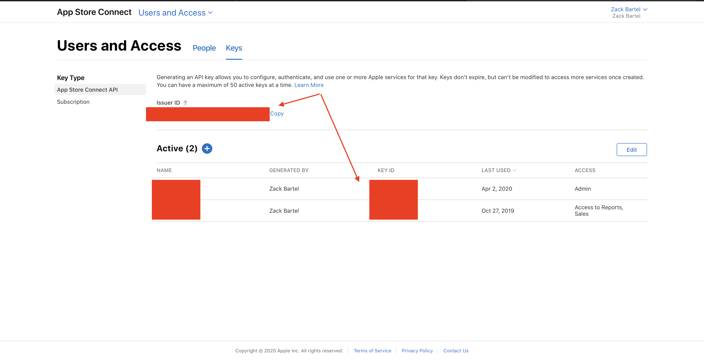

# AppStore Connect API for Golang
This project is not comprehensive or even in alpha state.

## Overview
Library and CLI application to download Sales and Financial data from the Apple AppStore. 
The example CLI application is the only documentation or example usage of the library, unfortunately.

### CLI
Run `make` to create a CLI app which uses the library. 

example use

Weeky JSON sales report from first week of September to third week of February
```
./connect SalesReport -d 2019-09-w1:2020-02-w3  -o json
```

Single day CSV sales report for January 1
```
./connect SalesReport -d 2020-01-01 -o csv
```


#### Setup credentials.yaml
1. Copy `credentials.yaml.example` to `credentials.yaml`
2. [Generate an API key](https://developer.apple.com/documentation/appstoreconnectapi/creating_api_keys_for_app_store_connect_api)
3. Add issuer_id, key_id, and private_key to credentials.yaml



