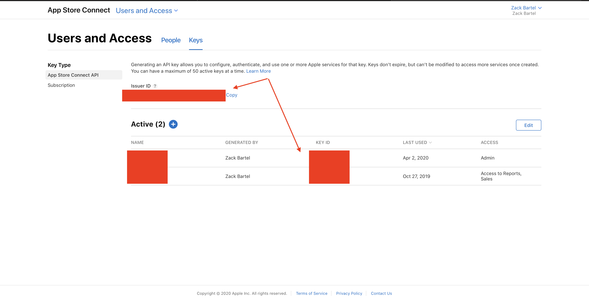

# AppStore Connect API for Golang

**NOTICE**: This project is not comprehensive or even in alpha state. It is a work in progress and is not suitable for production use. Use at your own risk. Consider someting much better like [appstore-sdk-go](https://github.com/Kachit/appstore-sdk-go).

## Overview
Library and CLI application to download Sales and Financial data from the Apple AppStore. 
The example CLI application is the only documentation or example usage of the library, unfortunately.

### CLI
Run `make` to create a CLI app which uses the library. 

### Time Ranges
The `-d` flag accepts a single date or a range separated by a colon (`:`). The format you provide determines the frequency of the data (Yearly, Monthly, Weekly, or Daily).

#### Examples
* **Daily**: `2020-01-01` or `2020-01-01:2020-01-05`
* **Weekly**: `2019-09-w1` or `2019-09-w1:2020-02-w3` (format is year-month-week)
* **Monthly**: `2020-01` or `2020-01:2020-05`
* **Yearly**: `2020` or `2018:2020`

### CLI Examples

Weekly JSON sales report from first week of September to third week of February:
```bash
./connect SalesReport -d 2019-09-w1:2020-02-w3  -o json
```

Single day CSV sales report for January 1st:
```bash
./connect SalesReport -d 2020-01-01 -o csv
```


#### Setup credentials.yaml
1. Copy `credentials.yaml.example` to `credentials.yaml`
2. [Generate an API key](https://developer.apple.com/documentation/appstoreconnectapi/creating_api_keys_for_app_store_connect_api)
3. Add issuer_id, key_id, and private_key to credentials.yaml



